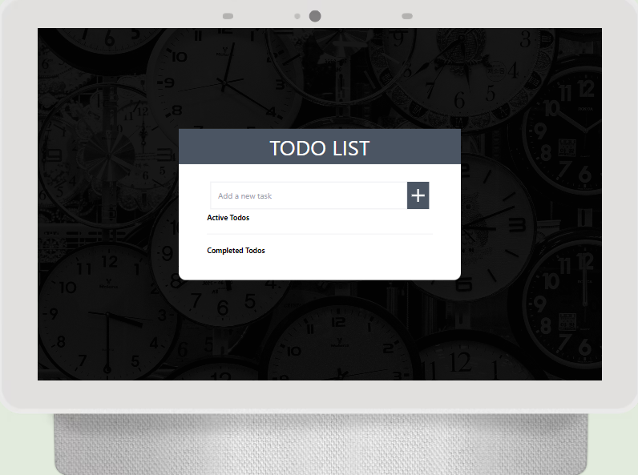

# Day 7: To-Do List App

## Challenge Task:
Today's focus was on mastering state management, event handling, and list rendering in React JS. The goal was to build a functional to-do list app that enhances understanding of React components and user interactions.

## Learning Session:

### Concepts Covered:
- **State in React:** Managing component state to handle dynamic data.
- **Handling Events in React:** Responding to user actions such as clicks and input changes.
- **Rendering Lists in React:** Dynamically rendering lists based on state data.

### Key Points:
- **State Management:** Learn how to manage and update state within a component.
- **Event Handling:** Handle user input and interaction efficiently.
- **Dynamic Rendering:** Render lists of items based on current state.

## Activity:

### Steps:
1. **Set Up React Environment:**
   Initialize a React app using `create-react-app` or your preferred setup.

2. **Create `TodoListApp` Component:**
   Build the core component to handle to-do items.

3. **Build the Form:**
   - Create an input field for entering new to-do items.
   - Add a button to submit the new to-do item.

4. **Implement State Management:**
   - Manage the input value and the list of to-do items using React's `useState` hook.
   - Handle adding new items to the list.

5. **Render the List:**
   - Dynamically render the list of to-do items below the form.
   - Add functionality to mark items as completed and delete items.

6. **Style the Application:**
   - Use Tailwind CSS for styling to make the app visually appealing.

## Technologies Used:
- **React JS:** For building the user interface.
- **Tailwind CSS:** For styling the application.
- **JavaScript:** For handling state and events.

## Screenshots:



## Live Link:
[View Live Demo](https://simple-to-do-app-eight.vercel.app/)

## Setup Instructions:
1. **Clone the repository:**
   ```bash
   git clone https://github.com/your-username/todo-list-app.git


## Getting Started with Create React App

This project was bootstrapped with [Create React App](https://github.com/facebook/create-react-app).

## Available Scripts

In the project directory, you can run:

### `npm start`

Runs the app in the development mode.\
Open [http://localhost:3000](http://localhost:3000) to view it in your browser.

The page will reload when you make changes.\
You may also see any lint errors in the console.

### `npm test`

Launches the test runner in the interactive watch mode.\
See the section about [running tests](https://facebook.github.io/create-react-app/docs/running-tests) for more information.

### `npm run build`

Builds the app for production to the `build` folder.\
It correctly bundles React in production mode and optimizes the build for the best performance.

The build is minified and the filenames include the hashes.\
Your app is ready to be deployed!

See the section about [deployment](https://facebook.github.io/create-react-app/docs/deployment) for more information.

### `npm run eject`

**Note: this is a one-way operation. Once you `eject`, you can't go back!**

If you aren't satisfied with the build tool and configuration choices, you can `eject` at any time. This command will remove the single build dependency from your project.

Instead, it will copy all the configuration files and the transitive dependencies (webpack, Babel, ESLint, etc) right into your project so you have full control over them. All of the commands except `eject` will still work, but they will point to the copied scripts so you can tweak them. At this point you're on your own.

You don't have to ever use `eject`. The curated feature set is suitable for small and middle deployments, and you shouldn't feel obligated to use this feature. However we understand that this tool wouldn't be useful if you couldn't customize it when you are ready for it.

## Learn More

You can learn more in the [Create React App documentation](https://facebook.github.io/create-react-app/docs/getting-started).

To learn React, check out the [React documentation](https://reactjs.org/).

### Code Splitting

This section has moved here: [https://facebook.github.io/create-react-app/docs/code-splitting](https://facebook.github.io/create-react-app/docs/code-splitting)

### Analyzing the Bundle Size

This section has moved here: [https://facebook.github.io/create-react-app/docs/analyzing-the-bundle-size](https://facebook.github.io/create-react-app/docs/analyzing-the-bundle-size)

### Making a Progressive Web App

This section has moved here: [https://facebook.github.io/create-react-app/docs/making-a-progressive-web-app](https://facebook.github.io/create-react-app/docs/making-a-progressive-web-app)

### Advanced Configuration

This section has moved here: [https://facebook.github.io/create-react-app/docs/advanced-configuration](https://facebook.github.io/create-react-app/docs/advanced-configuration)

### Deployment

This section has moved here: [https://facebook.github.io/create-react-app/docs/deployment](https://facebook.github.io/create-react-app/docs/deployment)

### `npm run build` fails to minify

This section has moved here: [https://facebook.github.io/create-react-app/docs/troubleshooting#npm-run-build-fails-to-minify](https://facebook.github.io/create-react-app/docs/troubleshooting#npm-run-build-fails-to-minify)
